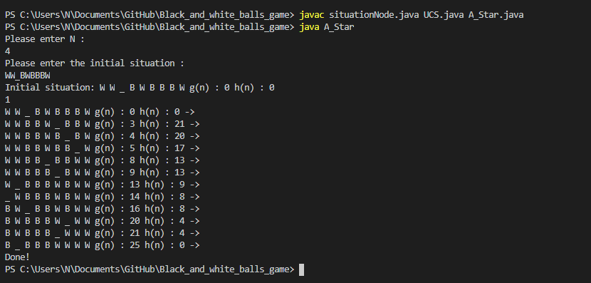

# Black_and_white_balls_game
 AI algorithms (UCS and A-Star) on a simple game.

## Game description and rules

The game's initial situation is a placement of white and black balls and a blank space. Black balls are marked by the letter 'B', white balls are marked by the letter 'W' and the blank space is marked by the letter '_'. The black and white balls must be the same in number. Their number is defined at the start of the game by the user. Note that the space must be exactly one. The user can type any situation that meets the requirements for the AI to solve, which brings us to the next question: what is a solution and how do we get to it?

The game's aim is to reorder the initial situation is such a way that all the black balls come before any white ball and the space character is not at the last spot. To do that, the player is allowed to move any ball that is no more than N spaces away from the blank space to the blank space, which leaves a blank space in its previous spot (where N is the count of white balls - or black). Every move comes with a cost, which is exactly the number of spaces that the ball moved to get to the blank space. The lesser the total cost to get to an acceptable final situation, the better.

A good example of a starting situation and the steps the computer takes to solve it:

Initial situation : W W _ B B

1. W W _ B B g(n) : 0 h(n) : 0 ->
2. W W B _ B g(n) : 1 h(n) : 9 ->
3. W _ B W B g(n) : 3 h(n) : 7 ->
4. _ W B W B g(n) : 4 h(n) : 6 ->
5. B W _ W B g(n) : 6 h(n) : 4 ->
6. B W B W _ g(n) : 8 h(n) : 2 ->
7. B W B _ W g(n) : 9 h(n) : 2 ->
8. B _ B W W g(n) : 11 h(n) : 0 ->
Done!

## UCS, A-Star algorithms

Those two algorithms have been implemented for the AI to solve the problem. In the example above, the situation was given to the A_Star script that I have implemented and at each step, the actual cost (g(n)) and the heuristic cost (h(n)) are printed out. For the UCS algorithm, the h(n) cost is always printed as 0, because as we know this algorithm doesn't use a heuristic function.

## Description of my A-Star heuristic function and why it's acceptable

For a heuristic function to be created we need to modify the problem by easing some of its restrictions.

On each side of every ball there will be an empty space in which the balls can hop to. For example:  BBWWeBWBW => eBeBeWeWeEeBeWeBeWe, where B: black, W: white, e: fake space, E: real space.

In addition, we assume that there is no limitation to how far each ball can move, which means that each ball can move more than N spaces away.

Starting from the left of the situation and moving to the right we ignore every 'B' ball until we find the first 'W'. From then on, each time we find a 'B' we increase k by one, where k expresses how many 'B' balls are placed on the right side of this particular white. We keep track of the distance each black ball has from the white and at the end we sum thoses distances in order to find out the cost of moving all those balls to the left side of the white. In this way we arrive to an acceptable final situation and we return the cost, since all the black balls are on the left of the most left-side white, which means that they are on the left of every white.

 In the case that the sum > ceiling(N/2) we prefer to move the white ball to the right of the most right-sided out of those black balls, as this move is substantially cheaper than moving the k black balls to the other side. If that's the case then we continue the same process for every white ball.

 We conclude that the cost a(n) of the relaxed problem is an acceptable heuristic function h(n) for our main problem, because each ball can move anywhere and we choose a cheap set of moves.

 ## Instructions

1. Download the files.
2. Compile the 3 .java files using the command "javac situationNode.java UCS.java A_Star.java".
3. If you wish to run the UCS algorithm use the command "java UCS". Else, use the command "java A_Star".
4. Follow the instructions.

Note: Some inputs might run seemingly forever. It is advised you don't assign a number greater than 4 to the N variable.

A good example that took about a minute to run:

